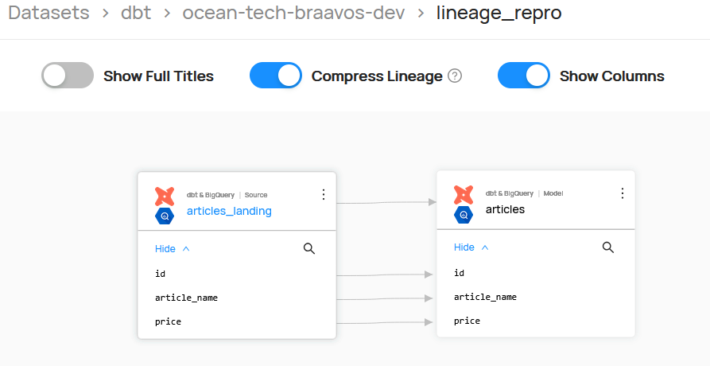
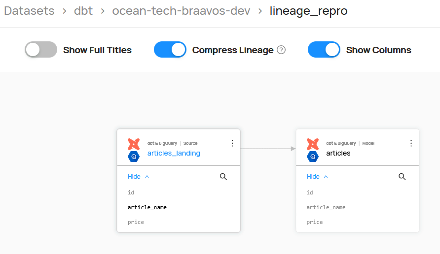

# Datahub DBT Column Level Lineage Repro

This project is a reproduction of an issue where column level lineage is not being generated with Datahub's DBT core integration.

The errors appears to be related to the [dbt_utils deduplication macro](https://github.com/dbt-labs/dbt-utils), which in
BigQuery uses the `ARRAY_AGG` function. We think it might be an edge-case on the bigquery dialect's AST parsing, but we are not sure. 

## Steps to reproduce
1. Setup a [dbt profile](https://docs.getdbt.com/docs/core/connect-data-platform/profiles.yml) for this project:
```yaml
lineage_repro:
  outputs:
    dev:
      dataset: lineage_repro
      job_execution_timeout_seconds: 900
      job_retries: 1
      location: EU
      method: oauth
      priority: interactive
      project: <your-gcp-project>
      threads: 8
      type: bigquery
  target: dev
```

2. Navigate to the dbt directory and run the dbt seed command to create the initial table `lineage_repro.articles_landing`:
```bash
cd dbt
dbt seed -t dev
```

3. (Optional) Once seeded, I needed to remove the file dbt/seeds/articles_landing.csv to avoid an error executing the dbt build command.
    It seems the table is not immediately available and the `dbt build` process fails.

4. Execute the following commands, as recommended by the [Datahub documentation](https://datahubproject.io/docs/generated/ingestion/sources/dbt/):
```bash
dbt source snapshot-freshness
dbt build -t dev
cp target/run_results.json target/run_results_backup.json
dbt docs generate -t dev
cp target/run_results_backup.json target/run_results.json
```

5. Copy the files from the dbt/target directory to the datahub/resources directory:
```bash
 cp ./target/catalog.json ../datahub/resources/catalog.json & cp ./target/manifest.json ../datahub/resources/manifest.json & cp ./target/run_results.json ../datahub/resources/run_results.json 
```

6. Navigate to the datahub folder and execute the DataHub ingestions:
   Please note that the `source.config.credential` section in `01_bigquery.dhub.yaml` needs to be filled in with your GCP project config.
```bash
cd ../datahub

datahub ingest -c 01_bigquery.dhub.yaml
datahub ingest -c 02_dbt.dhub.yaml 
```

The entities should appear in DataHub, but the column level lineage is not being generated.

Expected behaviour:


Actual behaviour:
